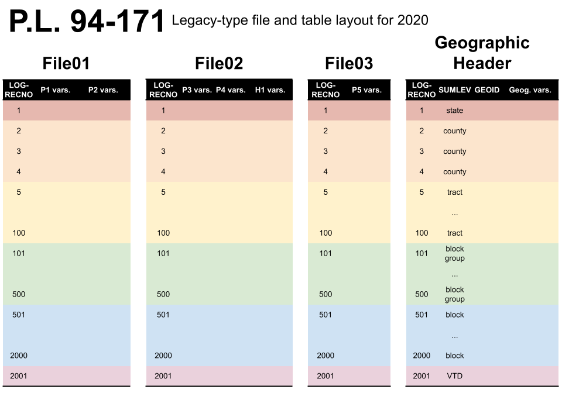

```{r, include = FALSE}
knitr::opts_chunk$set(
  collapse = TRUE,
  comment = "#>"
)
options(tinytiger.curl_quiet=TRUE)
```

The US Census Bureau releases redistricting data (P.L. 94-171) following the decennial census. This article walks through the basics of reading that data and getting it into working form.

# The P.L. 94-171 Legacy File
The redistricting data mandated by P.L. 94-171 is composed of [six tables, five
of population characteristics, and one of housing characteristics](https://www2.census.gov/programs-surveys/decennial/2020/technical-documentation/complete-tech-docs/summary-file/2020Census_PL94_171Redistricting_StatesTechDoc_English.pdf).
In the legacy data format, these six tables (and dozens of levels of geography)
are split into four files: File01, File02, File03, and the Geographic Header
Record. Files 01--03 have the actual decennial census data for each table,
while the geographic header has geographic identifiers (FIPS code, precinct IDs,
etc.) and information (area, water, etc.).



These four files have the same rows, each of which is identified by a `LOGRECNO`
number. Combining the columns shared across the four files yields the full 
P.L. 94-171 file

The basic unit of Census geography is the block; all other geographies are
constructed from them. But the P.L. 94-171 file is not composed of blocks alone.
The Census has already tabulated the six table statistics across every possible
level of geographies.  To get information for a single geography level---blocks,
or counties, or school districts---one needs only to subset to the rows which
correspond to this geographic level (coded in the `SUMLEV` column). 

So the basic process for working with legacy P.L. 94-171 data is:

1. Read in the four P.L. files (`pl_read()`, `pl_url()`)
1. Combine the four files into one, and subset to the desired geography level 
   (`pl_subset()`; geography level codes listed in `pl_geog_levels`)
1. Select the desired variables from the six included tables (`pl_select_standard()`)
1. Optionally, combine the processed data with the corresponding 
   [`tigris` shapefile](https://cran.r-project.org/package=tigris).

The utility function `pl_tidy_shp()` combines all of these steps into one
function for most common use case of tabulating basic redistricting information
at the block level. This is demonstrated in [the README](../index.html)

# Using the `PL94171` package

```{r setup, message=F, warning=F}
library(PL94171)
```

The four components of the P.L. 94-171 file should be downloaded into their own
directory. Here, we'll use the example data included in the package, from the
2018 end-to-end Census test in Providence County, Rhode Island, and read it into
our R session. In general, you can provide a URL in place of a file path, and
the package will read the data from the URL. The `pl_url()` function will
automatically construct the URL to the data for a given state and year.

```{r}
# `extdata/ri2018_2020Style.pl` is a directory with the four P.L. 94-171 files
path <- system.file("extdata/ri2018_2020Style.pl", package = "PL94171")
pl_raw <- pl_read(path)
# try `pl_read(pl_url("RI", 2010))`
```

This creates a large list where each individual P.L. 94-171 file component is a
separate entry in the list. If we look at the top of one of these entries,
we see the same structure as in the schematic above: each redistricting variable 
is a column, the rows are indexed by `LOGRECNO`, and various levels of
aggregation are all included as different sets of rows in the same table (notice
the countywide population counts in the first two rows).

```{r}
head(pl_raw$`00003`)
```

To subset to a desired geography level, we must first identify the corresponding
`SUMLEV` code. 

```{r}
print(pl_geog_levels)
```

Here, we'll look at Census tracts, which are `SUMLEV=140`.

```{r}
pl <- pl_subset(pl_raw, sumlev="140")
print(dim(pl))
```

We see that all four components have been combined into one large table, with
data for each of the seven Census tracts in the example file recorded in a 
single row. To extract [commonly-used variables](../reference/pl_select_standard.html)
from the 397 columns, we can run the following:

```{r}
pl <- pl_select_standard(pl, clean_names = TRUE)
print(pl)
```

Above, we set `clean_names = TRUE`, which is the default. This creates a set of
variables familiar to the `redist` family of packages.

To combine these data with a shapefile, we must use the `tinytiger` package.
The `GEOID` column is shared between the P.L. 94-171 data and the TIGER
shapefiles from `tinytiger`.

```{r message=F, warning=F, eval = FALSE}
library(tinytiger)
library(sf)
library(dplyr)
library(ggplot2)

ri_tracts = tt_tracts("RI", county="Providence", year=2020)
```

```{r, echo = FALSE}
library(tinytiger)
library(sf)
library(dplyr)
library(ggplot2)
with_retry <- function(fn, ..., max_iter = 5) {
    out <- NULL
    i <- 1
    while (i <= max_iter && is.null(out)) {
        try({out <- fn(...)}, silent = TRUE)
        i <- i + 1
    } 
    out
}

ri_tracts = with_retry(fn = tt_tracts, state = "RI", county = "Providence", year = 2020)
```

Then we can join the shapes and data
```{r, eval = !is.null(ri_tracts)}
full_join(pl, ri_tracts, by="GEOID") %>%
ggplot(aes(fill=pop, geometry=geometry)) +
    geom_sf(size=0) +
    theme_void()
```
